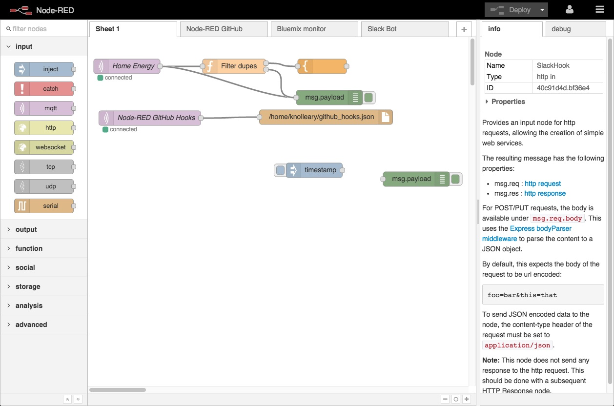

<!--
N.B.: This README was automatically generated by https://github.com/YunoHost/apps/tree/master/tools/readme_generator
It shall NOT be edited by hand.
-->

# Node-RED for YunoHost

[](https://dash.yunohost.org/appci/app/nodered)  

[](https://install-app.yunohost.org/?app=nodered)

*[Lire ce readme en français.](./README_fr.md)*

> *This package allows you to install Node-RED quickly and simply on a YunoHost server.
If you don't have YunoHost, please consult [the guide](https://yunohost.org/#/install) to learn how to install it.*

## Overview

Node-RED is a programming tool for wiring together hardware devices, APIs and online services in new and interesting ways.

It provides a browser-based editor that makes it easy to wire together flows using the wide range of nodes in the palette that can be deployed to its runtime in a single-click.

### Features

- Browser-based flow editing
- On-click deployment of the flows
- Over 225,000 modules available
- Custom JavaScript functions can be written

### Override the default settings

From the installation directory, go edit the `__INSTALL_DIR__/data/settings.user.js`. For example:

```js
module.exports = (defaultSettings) => ({
    lang: "de", // define the language as "de"
    exportGlobalContextKeys: true, // override the `exportGlobalContextKeys` value
logging: { // replace the default logging option ...defaultSettings.logging, // this will reinject the default settings in logging
        console: {
            ...defaultSettings.logging.level, // this will reinject the default settings in logging.console
            level: "debug", // but here, we override the "info" level by "debug"
        },
    },
});
```

You can check the default settings Yunohost generates at `__INSTALL_DIR__/data/settings.js` and find the documentation for configuring Node-RED here: <https://nodered.org/docs/user-guide/runtime/configuration>


**Shipped version:** 3.1.4~ynh1

## Screenshots



## Documentation and resources

* Official app website: <https://nodered.org>
* Official user documentation: <https://nodered.org/docs/>
* Upstream app code repository: <https://github.com/node-red/node-red>
* YunoHost Store: <https://apps.yunohost.org/app/nodered>
* Report a bug: <https://github.com/YunoHost-Apps/nodered_ynh/issues>

## Developer info

Please send your pull request to the [testing branch](https://github.com/YunoHost-Apps/nodered_ynh/tree/testing).

To try the testing branch, please proceed like that.

``` bash
sudo yunohost app install https://github.com/YunoHost-Apps/nodered_ynh/tree/testing --debug
or
sudo yunohost app upgrade nodered -u https://github.com/YunoHost-Apps/nodered_ynh/tree/testing --debug
```

**More info regarding app packaging:** <https://yunohost.org/packaging_apps>