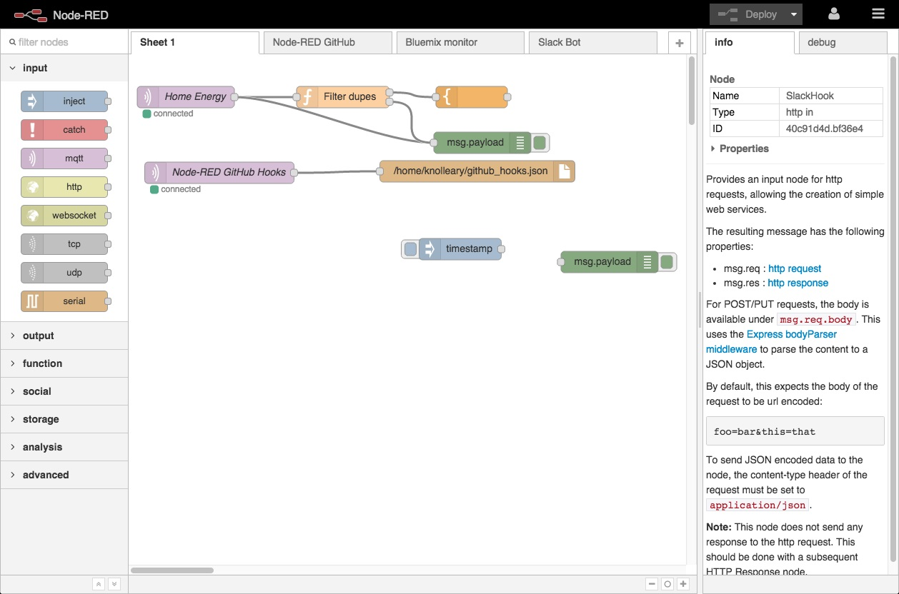

# Node-RED pour YunoHost

[](https://dash.yunohost.org/appci/app/nodered)   
[](https://install-app.yunohost.org/?app=nodered)

*[Read this readme in english.](./README.md)*
*[Lire ce readme en français.](./README_fr.md)*

> *This package allows you to install nodered quickly and simply on a YunoHost server.
If you don't have YunoHost, please consult [the guide](https://yunohost.org/#/install) to learn how to install it.*

## Vue d'ensemble

Programmation par flux de données pour l'Internet des objets

**Version incluse:** 1.3.5~ynh1


## Captures d'écran


   


## Avertissements / informations importantes

* Le système de permissions de YunoHost permet de paramétrer les accès à Node-RED. Par défaut, seul l'administrateur sélectionné lors de l'installation y a accès.
* Une permission `ui` est diponible au cas où vous installeriez les nodes de `node-red-dashboard`. Elle donne accès au tableau de bord à tout utilisateur ou visiteur autorisé, au chemin `/ui` après l'adresse spécifiée pour Node-RED.
* Une permission `nodes` est disponible au cas où vous utiliseriez les nodes HTTP. Par défaut, les visiteurs auront accès à ces nodes, au chemin `/red-nodes/...` après l'adresse spécifiée pour Node-RED.


## Documentations et ressources

* Site official de l'app : https://nodered.org
* Documentation officielle utilisateur: https://nodered.org/docs/

* Dépôt de code officiel de l'app:  https://github.com/node-red/node-red
* Documentation YunoHost pour cette app: https://yunohost.org/app_nodered
* Signaler un bug: https://github.com/YunoHost-Apps/nodered_ynh/issues

## Informations pour les développeurs

Merci de faire vos pull request sur la [branche testing](https://github.com/YunoHost-Apps/nodered_ynh/tree/testing).

Pour essayer la branche testing, procédez comme suit.
```
sudo yunohost app install https://github.com/YunoHost-Apps/nodered_ynh/tree/testing --debug
or
sudo yunohost app upgrade nodered -u https://github.com/YunoHost-Apps/nodered_ynh/tree/testing --debug
```

**Plus d'infos sur le packaging d'applications:** https://yunohost.org/packaging_apps